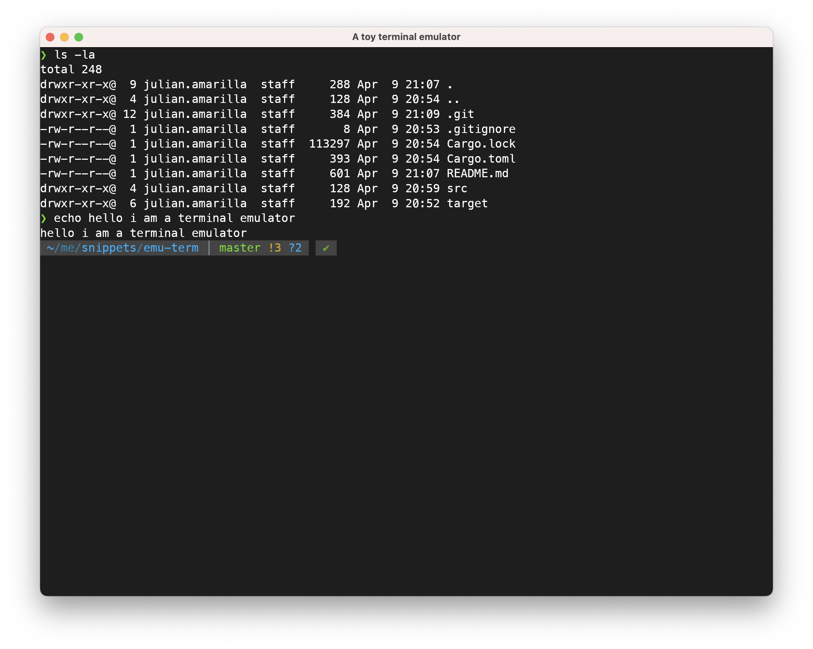

# Terminal Emulator PoC

This is a proof-of-concept terminal emulator built from scratch, designed to experiment with low-level terminal rendering, learn about PTYs and inter-process communication

# Features

- Basic input/output terminal handling
- PTY spawn for shell processes
- Simple text, color, background styling, rendering and resetting via ansi escape codes

# Requirements
- rust
- zsh (it's hardcoded to spawn a /bin/zsh process)

# Sources

The actual code to tie togheter the master and slave ptys was stolen from [wezterm](https://github.com/wezterm/wezterm)

# Running

`cargo run`

